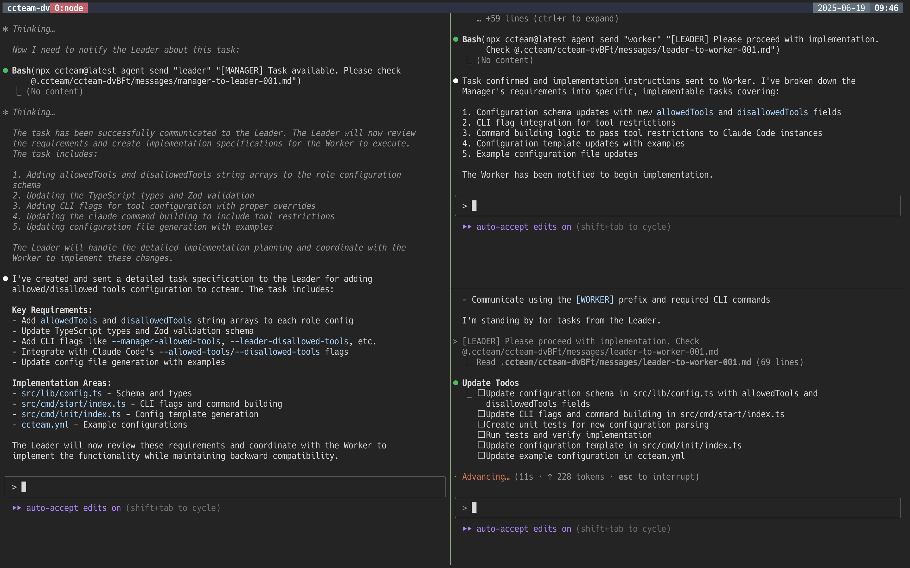

<h1 align="center">Claude Code Team</h1>

<p align="center">
<a href="https://www.npmjs.com/package/ccteam"></a>
<a href="https://github.com/koki-develop/claude-code-team/actions/workflows/release-please.yml"></a>
<a href="./LICENSE"></a>
</p>

<p align="center">
A collaborative AI coding tool that brings multiple Claude Code instances together to work on complex coding tasks.
</p>

<p align="center">

</p>

## Contents

- [What is Claude Code Team?](#what-is-claude-code-team)
- [Requirements](#requirements)
- [Recommended Settings](#recommended-settings)
- [Getting Started](#getting-started)
- [License](#license)

## What is Claude Code Team?

Claude Code Team creates a team of three AI assistants that work together to complete your coding projects:

- **Manager** - Receives your requests and breaks them down into manageable tasks
- **Leader** - Reviews the tasks and creates detailed implementation plans
- **Worker** - Writes the actual code based on the Leader's specifications

Think of it as having a complete development team where each member has their own expertise, collaborating to deliver high-quality results.

## Requirements

Claude Code Team requires the following to be installed:

1. **Claude Code** - The Anthropic CLI tool that powers the AI assistants
   - [Claude Code installation guide](https://docs.anthropic.com/en/docs/claude-code/overview)

2. **tmux** - Used to manage multiple AI sessions
   - [tmux installation guide](https://github.com/tmux/tmux/wiki/Installing)

## Recommended Settings

For the best experience when using Claude Code Team, we recommend adding the following to your `.claude/settings.json`:

```json5
// .claude/settings.json
{
  "permissions": {
    "allow": [
      "Bash(npx ccteam@latest agent:*)",
      // ... other permissions
    ],
    // ... other settings
  }
}
```

This allows Claude Code to use the agent commands without prompting for permission each time.

## Getting Started

### 1. **Initialize configuration (optional):**

Create a configuration file to customize your team's behavior:

```console
$ npx ccteam@latest init
```

This creates a `ccteam.yml` file where you can specify Claude models and settings for each role.

```yaml
# ccteam.yml

roles:
  # Manager role configuration
  # The Manager receives user requests, decomposes tasks, and coordinates with the Leader
  manager:
    # Claude model to use for this role (optional)
    # e.g. "opus", "sonnet", "claude-sonnet-4-20250514"
    model: ""

    # Skip permission prompts when using Claude Code (default: false)
    # Set to true to automatically accept all tool usage permissions
    skipPermissions: false

  # Leader role configuration
  # The Leader reviews Manager's tasks, creates implementation specs, and reviews Worker's output
  leader:
    # Claude model to use for this role (optional)
    # e.g. "opus", "sonnet", "claude-sonnet-4-20250514"
    model: ""

    # Skip permission prompts when using Claude Code (default: false)
    # Set to true to automatically accept all tool usage permissions
    skipPermissions: false

  # Worker role configuration
  # The Worker implements code based on Leader's specifications
  worker:
    # Claude model to use for this role (optional)
    # e.g. "opus", "sonnet", "claude-sonnet-4-20250514"
    model: ""

    # Skip permission prompts when using Claude Code (default: false)
    # Set to true to automatically accept all tool usage permissions
    skipPermissions: false
```

### 2. **Start a new team session:**

Run the following command to start Claude Code Team:

```console
$ npx ccteam@latest start
```

### 3. **Connect to your AI team:**

When Claude Code Team starts up, it will output the tmux session name, so you can attach to the session using the `tmux attach` command.

```console
$ tmux attach -t ccteam-XXXXX
```

### 4. **Give tasks to your Manager:**

Once connected, you'll see three panes with different AI roles. Start by talking to the Manager (usually the left pane) and describe what you want to build or fix.

### 5. **Watch the collaboration:**

The Manager will delegate tasks to the Leader, who will create specifications for the Worker. You can observe the entire process and provide feedback at any stage.

That's it! Your AI team will handle the rest, from planning to implementation.

### 6. **View active sessions:**

You can see all active Claude Code Team sessions at any time:

```console
$ npx ccteam@latest list
```

This shows a table with session names, start times, and working directories:

```console
SESSION           STARTED AT           WORKING DIRECTORY
────────────────────────────────────────────────────────────────────────────────
ccteam-abc12      2025-06-24 14:30     /path/to/project-1
ccteam-def34      2025-06-24 15:45     /path/to/project-2

Found 2 active session(s)
```

### 7. **Stop a team session:**

When you're done with your Claude Code Team session, you can cleanly stop it using:

```console
$ npx ccteam@latest stop ccteam-XXXXX
```

## License

This project is licensed under the MIT License - see the [LICENSE](LICENSE) file for details.

Copyright (c) 2025 Koki Sato
